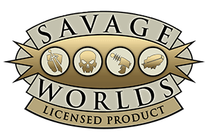

# 

## RPGSavageWorldsApuntes
Pequeños apuntes para revisar antes de una partida de Savage Worlds

- [Crear un personaje](creacionpjsw.md)
- [Realizar una acción](acciones.md)
- [Mecánica de un combate](combate.md)
- [Ventajas](ventajas.md) y [desventajas](desventajas.md)

#### Herramientas online para tirar dados:

Te servirán para tirar dados de todo tipo pero implementan opciones específicas de Savage

- [Dadiños!](https://dados.tr4ck.net/#!/board)
- [Tirador de dados de immaterialplane](https://immaterialplane.com/apps/swdr/)

#### De dónde sale todo esto (Bibliografía?):

Las normas aquí descritas son un extracto del manual simplificado disponible gratuitamente en la web de [HTPublishers](https://htpublishers.es/). 

Échate un par de partidas con ellas y si te gustan, ve a la página para comprar el manual grande.
