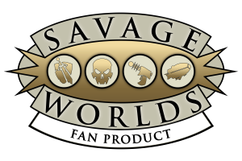

# 
## RPGSavageWorldsApuntes
Pequeños apuntes para revisar antes de una partida de Savage Worlds

  

- [Crear un personaje](creacionpjsw.md)
- [Realizar una acción](acciones.md)
- [Mecánica de un combate](combate.md)
- [Ventajas](ventajas.md) y [desventajas](desventajas.md)
- [Habilidades](habilidades.md)
- [Estados](estados.md)
- [Poderes](poderes.md)

 
   

#### Herramientas online para tirar dados:

Te servirán para tirar dados de todo tipo pero implementan opciones específicas de Savage

- [Dadiños!](https://dados.tr4ck.net/#!/board)
- [Tirador de dados de immaterialplane](https://immaterialplane.com/apps/swdr/)
 
 

#### De dónde sale todo esto (Bibliografía?):

Las normas aquí descritas son un extracto del manual simplificado disponible gratuitamente en la web de [HTPublishers](https://htpublishers.es/). 

Échate un par de partidas con ellas y si te gustan, ve a la página para comprar el manual grande.
   

Cumpliendo con los acuerdos de licencia fan, reproduzco el siguiente texto.

Note: “This game references the Savage Worlds game system, available from Pinnacle Entertainment Group at [www.peginc.com](www.peginc.com). Savage Worlds and all associated logos and trademarks are copyrights of Pinnacle Entertainment Group. Used with permission. Pinnacle makes no representation or warranty as to the quality, viability, or suitability for purpose of this product.”

Más info sobre las licencias de Savage World [aquí](https://htpublishers.es/licencias-para-savage-worlds/)